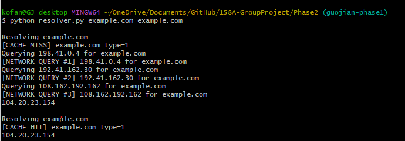
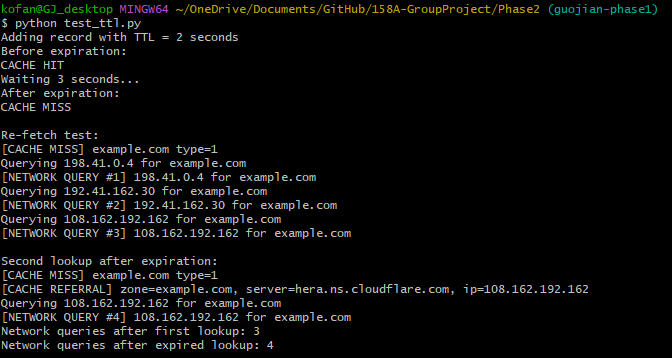
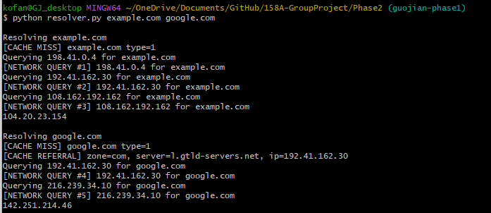

# Phase 2 - DNS Resolver with TTL Cache

## Overview

Phase 2 extends the baseline iterative DNS resolver from Phase 1 by adding an in-memory DNS record cache.

The resolver now:

- Stores DNS records using `(name, record type)` as the cache key.
- Stores final A records and intermediate NS/glue records.
- Honors the TTL of each cached record.
- Removes expired records instead of serving stale data.
- Checks the cache before sending a network query.
- Re-fetches records after their TTL expires.
- Reuses cached NS and glue records to skip unnecessary hierarchy lookups.
- Logs cache hits, cache misses, cached referrals, and network query counts.

The cache remains available during one execution of the program. Therefore, multiple domains can be supplied in one command so they share the same cache.

## Files

```text
Phase2/
├── dns_resolver.py
├── resolver.py
├── test_ttl.py
├── README.md
├── repeated_lookup.png
├── different_name.png
└── ttl_test.png
```

### File Descriptions

- `dns_resolver.py`
  - Builds DNS queries.
  - Parses DNS responses.
  - Performs iterative DNS resolution.
  - Implements the TTL cache.
  - Caches final A records, NS records, and glue A records.

- `resolver.py`
  - Provides the command-line interface.
  - Accepts one or more domain names.
  - Allows multiple lookups to share the same in-memory cache.

- `test_ttl.py`
  - Tests whether a cached record expires after its TTL.
  - Tests whether the resolver sends a new network query after the final cached answer expires.

- `repeated_lookup.png`
  - Screenshot of the repeated lookup cache test.

- `different_name.png`
  - Screenshot of the intermediate NS/glue reuse test.

- `ttl_test.png`
  - Screenshot of the TTL expiration and re-fetch test.

## How to Run

Clone the repository:

```bash
git clone https://github.com/Aaditya-Deshmukh/158A-GroupProject.git
```

Enter the repository:

```bash
cd 158A-GroupProject
```

Switch to the Phase 2 branch:

```bash
git switch guojian-phase2
```

Enter the Phase 2 directory:

```bash
cd Phase2
```

### Resolve One Domain

```bash
python resolver.py example.com
```

Example output:

```text
Resolving example.com
[CACHE MISS] example.com type=1
Querying 198.41.0.4 for example.com
[NETWORK QUERY #1] 198.41.0.4 for example.com
Querying 192.41.162.30 for example.com
[NETWORK QUERY #2] 192.41.162.30 for example.com
Querying 108.162.192.162 for example.com
[NETWORK QUERY #3] 108.162.192.162 for example.com
104.20.23.154
```

The exact IP address may differ because some domains return multiple valid A records or use DNS-based load balancing.

### Test a Repeated Lookup

```bash
python resolver.py example.com example.com
```

### Test Reuse of Cached NS and Glue Records

```bash
python resolver.py example.com google.com
```

### Run the TTL Expiration Test

```bash
python test_ttl.py
```

## Phase 2 Implementation

### Cache Key

DNS records are cached using:

```text
(normalized domain name, record type)
```

Domain names are normalized before being used as cache keys.

Normalization includes:

- Converting the name to lowercase.
- Removing a trailing period.
- Converting byte strings to regular Python strings when necessary.

For example, the following names use the same cache key:

```text
example.com
Example.COM
example.com.
```

### Cached Records

The resolver caches records from all three DNS response sections:

- Answer section
- Authority section
- Additional section

This allows the resolver to cache:

- Final A records.
- NS records learned during referrals.
- Glue A records for nameservers.

### TTL Handling

Each cache entry stores:

- The DNS resource record.
- The time when the record expires.

The expiration time is calculated as:

```text
current time + record TTL
```

Before returning a cached entry, the resolver checks whether its expiration time has passed.

If the entry has expired:

- It is removed from the cache.
- It is not returned to the caller.
- The resolver performs a new network query when needed.

Records with a TTL of zero are not reused.

### Cache Lookup Behavior

Before sending a DNS request, the resolver first checks whether the requested record is already cached.

If the record is cached and has not expired, the resolver prints:

```text
[CACHE HIT]
```

and returns the cached record without sending a new DNS packet.

If no valid cached answer exists, the resolver prints:

```text
[CACHE MISS]
```

and continues with iterative resolution.

### Intermediate NS and Glue Reuse

The resolver also caches NS and glue A records learned while following DNS referrals.

When resolving another name under the same TLD, the resolver searches for a cached NS referral and its cached glue A record.

If one is found, the resolver prints:

```text
[CACHE REFERRAL]
```

and begins from the cached nameserver instead of starting again at the root server.

### Network Query Logging

Each actual DNS request is logged as:

```text
[NETWORK QUERY #N]
```

This makes it possible to verify that cache hits do not send additional network requests.

## Test Cases

### Test Case 1 - Repeated Lookup Uses the Cache

#### Purpose

Verify that a repeated lookup of the same name is served from the cache without sending new network queries.

#### Command

```bash
python resolver.py example.com example.com
```

#### Relevant Output

```text
Resolving example.com
[CACHE MISS] example.com type=1
Querying 198.41.0.4 for example.com
[NETWORK QUERY #1] 198.41.0.4 for example.com
Querying 192.41.162.30 for example.com
[NETWORK QUERY #2] 192.41.162.30 for example.com
Querying 108.162.192.162 for example.com
[NETWORK QUERY #3] 108.162.192.162 for example.com
104.20.23.154

Resolving example.com
[CACHE HIT] example.com type=1
104.20.23.154
```

#### Verification

The first lookup displayed:

```text
[CACHE MISS] example.com type=1
```

and required three network queries.

The second lookup displayed:

```text
[CACHE HIT] example.com type=1
```

No new network query was printed during the second lookup. The network query count remained at three.

This confirms that the repeated lookup was served directly from the cache.

#### Screenshot



---

### Test Case 2 - TTL Expiration and Re-fetching

#### Purpose

Verify that:

1. A cached record is available before its TTL expires.
2. An expired record is not returned.
3. The resolver sends a new network query after the final cached answer expires.

#### Command

```bash
python test_ttl.py
```

#### Relevant Output

```text
Adding record with TTL = 2 seconds
Before expiration:
CACHE HIT
Waiting 3 seconds...
After expiration:
CACHE MISS

Re-fetch test:
[CACHE MISS] example.com type=1
Querying 198.41.0.4 for example.com
[NETWORK QUERY #1] 198.41.0.4 for example.com
Querying 192.41.162.30 for example.com
[NETWORK QUERY #2] 192.41.162.30 for example.com
Querying 108.162.192.162 for example.com
[NETWORK QUERY #3] 108.162.192.162 for example.com

Second lookup after expiration:
[CACHE MISS] example.com type=1
[CACHE REFERRAL] zone=example.com, server=hera.ns.cloudflare.com, ip=108.162.192.162
Querying 108.162.192.162 for example.com
[NETWORK QUERY #4] 108.162.192.162 for example.com
Network queries after first lookup: 3
Network queries after expired lookup: 4
```

#### Verification

The synthetic test record was inserted with:

```text
TTL = 2 seconds
```

Immediately after insertion, the cache returned:

```text
CACHE HIT
```

The program then waited three seconds, which is longer than the record's TTL.

After the wait, the cache returned:

```text
CACHE MISS
```

This confirms that the expired record was not served.

The second part of the test performed a real lookup for `example.com`.

The first lookup required three network queries:

```text
Network queries after first lookup: 3
```

The final cached A record was then marked as expired.

During the second lookup, the resolver displayed another cache miss and sent network query number four:

```text
[NETWORK QUERY #4]
```

The final count was:

```text
Network queries after expired lookup: 4
```

This confirms that the resolver re-fetched the answer instead of returning the expired cached A record.

The resolver reused a still-valid cached authoritative NS/glue referral:

```text
[CACHE REFERRAL] zone=example.com
```

Therefore, it did not need to repeat the complete root and TLD walk.

#### Screenshot



---

### Test Case 3 - Reusing Cached NS and Glue Records

#### Purpose

Verify that a query for a different name under the same TLD reuses cached NS and glue records.

Both `example.com` and `google.com` are under the `.com` TLD.

#### Command

```bash
python resolver.py example.com google.com
```

#### Relevant Output

```text
Resolving example.com
[CACHE MISS] example.com type=1
Querying 198.41.0.4 for example.com
[NETWORK QUERY #1] 198.41.0.4 for example.com
Querying 192.41.162.30 for example.com
[NETWORK QUERY #2] 192.41.162.30 for example.com
Querying 108.162.192.162 for example.com
[NETWORK QUERY #3] 108.162.192.162 for example.com
104.20.23.154

Resolving google.com
[CACHE MISS] google.com type=1
[CACHE REFERRAL] zone=com, server=l.gtld-servers.net, ip=192.41.162.30
Querying 192.41.162.30 for google.com
[NETWORK QUERY #4] 192.41.162.30 for google.com
Querying 216.239.34.10 for google.com
[NETWORK QUERY #5] 216.239.34.10 for google.com
142.251.214.46
```

#### Verification

The first lookup began at the root server:

```text
Querying 198.41.0.4 for example.com
```

During this lookup, the resolver learned and cached the `.com` NS records and their glue A records.

The second lookup for `google.com` displayed:

```text
[CACHE REFERRAL] zone=com, server=l.gtld-servers.net, ip=192.41.162.30
```

The resolver then began directly at the cached `.com` TLD server:

```text
Querying 192.41.162.30 for google.com
```

It did not query root server `198.41.0.4` again for `google.com`.

This confirms that the resolver reused cached intermediate NS and glue records and skipped the root round trip.

The resolver still needed to query the `.com` TLD server for Google's authoritative nameserver because the earlier `example.com` lookup did not provide authoritative information for `google.com`.

#### Screenshot



## Test Summary

| Requirement | Command | Result |
|---|---|---|
| Repeated lookup is served from cache | `python resolver.py example.com example.com` | Passed |
| Cache hit sends no new network queries | Query count remained at 3 | Passed |
| Cached entry expires after TTL | `python test_ttl.py` | Passed |
| Expired entry is not served | Cache changed from hit to miss after 3 seconds | Passed |
| Expired answer is re-fetched | Query count increased from 3 to 4 | Passed |
| NS records are cached | `.com` cached referral was found | Passed |
| Glue A records are cached | Cached `.com` nameserver IP was reused | Passed |
| Different domain under the same TLD skips root | `google.com` began at the cached `.com` server | Passed |

## Known Behavior

The cache is stored in memory.

This means the cache is cleared when the Python program exits.

For example, these two separate commands do not share a cache:

```bash
python resolver.py example.com
python resolver.py example.com
```

To test cache reuse, both domains must be supplied in the same command:

```bash
python resolver.py example.com example.com
```

The resolver currently returns one A record even when a DNS response contains multiple A records.

The exact returned IP address may change between runs because some domains use multiple valid A records or DNS-based load balancing.

## References

- RFC 1035 Section 3.2.1 - Resource record TTL.
- RFC 1035 Section 4.1.3 - Resource record format.
- Implement DNS in a Weekend: https://implement-dns.wizardzines.com/