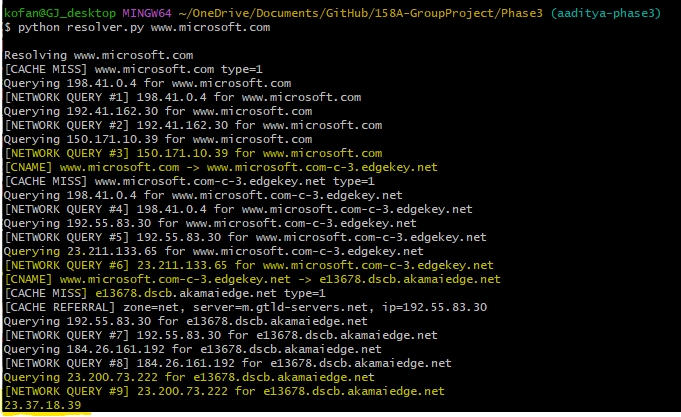
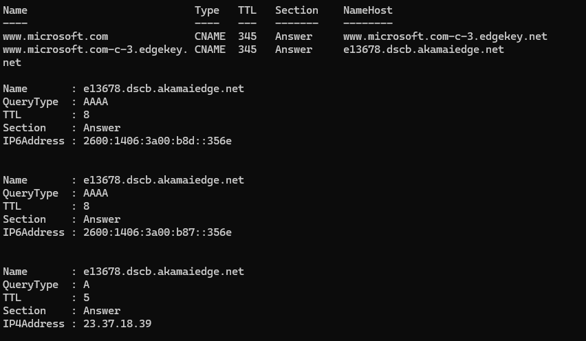
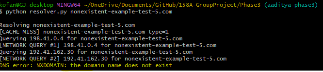
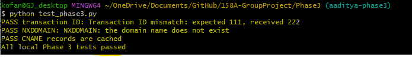

# Phase 3 - DNS Resolver Extensions

## Overview

Phase 3 adds two extensions to the Phase 2 resolver:

1. CNAME resolution.
2. Improved DNS error handling and transaction ID validation.

The Phase 2 TTL cache is still used without changing the command-line structure.

## Files

```text
Phase3/
├── dns_resolver.py
├── resolver.py
├── test_phase3.py
├── README.md
├── cname_resolution.png
├── cname_verification.png
├── nxdomain_test.png
└── phase3_tests.png
```

### File Descriptions

- `dns_resolver.py`
  - Builds and parses DNS packets.
  - Performs iterative DNS resolution.
  - Keeps the Phase 2 TTL cache.
  - Follows CNAME records.
  - Checks RCODE values.
  - Verifies transaction IDs.

- `resolver.py`
  - Provides the command-line interface.
  - Accepts one or more domain names.
  - Prints specific DNS errors.

- `test_phase3.py`
  - Tests transaction ID mismatch handling.
  - Tests NXDOMAIN handling.
  - Tests that CNAME records can be cached.

- `cname_resolution.png`
  - Shows the resolver following the Microsoft CNAME chain and returning an IPv4 address.

- `cname_verification.png`
  - Shows the same CNAME chain verified with `Resolve-DnsName`.

- `nxdomain_test.png`
  - Shows the resolver returning a specific NXDOMAIN error.

- `phase3_tests.png`
  - Shows the local Phase 3 tests passing.

## How to Run

Enter the Phase 3 directory:

```bash
cd Phase3
```

Resolve one domain:

```bash
python resolver.py www.microsoft.com
```

Resolve more than one domain while sharing the cache:

```bash
python resolver.py example.com www.microsoft.com
```

Run local tests:

```bash
python test_phase3.py
```

## Phase 3 Extension 1 - CNAME Resolution

### RFC Gap

The Phase 2 resolver only returned direct A records. Some valid names return a CNAME record that points to another domain name.

RFC 1034 Section 3.6.2 describes aliases and canonical names.

### Implementation

The resolver now:

- Parses CNAME records as DNS names.
- Caches CNAME records using `(name, TYPE_CNAME)`.
- Follows the CNAME target.
- Stops when an A record is found.
- Detects repeated names in the chain.
- Limits the chain to 10 CNAME records.

### Test Case

Command:

```bash
python resolver.py www.microsoft.com
```

Relevant output from our test:

```text
[CNAME] www.microsoft.com -> www.microsoft.com-c-3.edgekey.net
[CNAME] www.microsoft.com-c-3.edgekey.net -> e13678.dscb.akamaiedge.net
23.37.18.39
```

The exact final IP address may differ because Microsoft and Akamai use DNS load balancing.

#### Resolver Result



### Verification

We compared the result with PowerShell:

```powershell
Resolve-DnsName www.microsoft.com
```

`Resolve-DnsName` showed the same CNAME chain and returned the same IPv4 address during our test.



## Phase 3 Extension 2 - DNS Errors and Transaction IDs

### RFC Gap

The Phase 2 resolver did not inspect the RCODE field and did not verify that the response transaction ID matched the query.

RFC 1035 Section 4.1.1 defines the DNS header, transaction ID, and RCODE field.

### Implementation

The resolver now recognizes:

- FORMERR
- SERVFAIL
- NXDOMAIN
- NOTIMP
- REFUSED

A response with the wrong transaction ID is rejected before its records are cached or returned.

### NXDOMAIN Test Case

Command:

```bash
python resolver.py nonexistent-example-test-5.com
```

Relevant output:

```text
DNS error: NXDOMAIN: the domain name does not exist
```

This is more useful than the generic error produced by the earlier resolver.



### Transaction ID and Local Tests

Command:

```bash
python test_phase3.py
```

Output:

```text
PASS transaction ID: Transaction ID mismatch: expected 111, received 222
PASS NXDOMAIN: NXDOMAIN: the domain name does not exist
PASS CNAME records are cached
All local Phase 3 tests passed
```



## Before and After

### CNAME Resolution

Before Phase 3, the resolver only looked for direct A records. A CNAME-only response could fail because the alias target was not followed.

After Phase 3, the resolver follows each CNAME target until it reaches an A record. The Microsoft test followed two CNAME records before returning the final address.

### Error Handling

Before Phase 3, a nonexistent domain could produce a generic failure.

After Phase 3, the resolver reads the RCODE field and prints a specific NXDOMAIN message.

### Transaction ID Validation

Before Phase 3, the resolver accepted a DNS response without checking whether its transaction ID matched the query.

After Phase 3, a mismatched transaction ID causes the response to be rejected before it is cached or returned.

## Test Summary

| Requirement | Command | Result |
|---|---|---|
| Follow a CNAME to its canonical name | `python resolver.py www.microsoft.com` | Passed |
| Follow more than one CNAME | Microsoft CNAME chain | Passed |
| Return the final A record | Microsoft test | Passed |
| Compare against a system DNS tool | `Resolve-DnsName www.microsoft.com` | Passed |
| Display a specific NXDOMAIN error | `python resolver.py nonexistent-example-test-5.com` | Passed |
| Detect transaction ID mismatch | `python test_phase3.py` | Passed |
| Cache CNAME records | `python test_phase3.py` | Passed |

## References

- RFC 1034 Section 3.6.2 - Aliases and canonical names.
- RFC 1035 Section 4.1.1 - DNS header, ID, and RCODE.
- Implement DNS in a Weekend: https://implement-dns.wizardzines.com/
